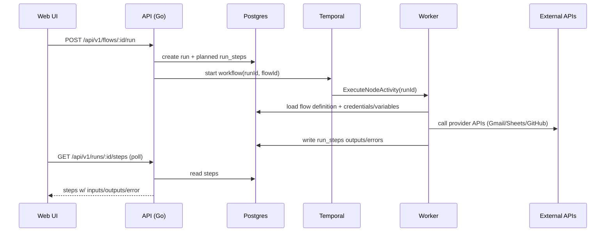

# FlowCraft Monorepo

FlowCraft is a workflow automation tool (n8n-style) with:

- Visual workflow builder (React Flow)
- Personal + Project scopes (workflows, credentials, variables)
- Real integrations via stored credentials (Google + GitHub)
- Temporal-based execution with step-by-step run history

**Tech stack**

- Frontend: Next.js (App Router) + Tailwind + Zustand (`/web`)
- Backend: Go + Gin + PostgreSQL + Temporal (`/api`)

## Architecture (high level)

```mermaid
flowchart LR
  U[User] -->|Browser| WEB[Web (Next.js)]
  WEB -->|REST: /api/v1| API[API (Go/Gin)]
  API -->|SQL| PG[(Postgres)]
  API -->|Start workflow| TEMP[Temporal Server]
  TEMP -->|Run activities| WK[Worker (Go)]
  WK -->|SQL (read flows/creds/vars, write runs)| PG
  WK -->|OAuth refresh + API calls| EXT[External APIs]
  EXT --> GGL[Google (Gmail/Sheets)]
  EXT --> GH[GitHub]
```

## Execution flow (what happens when you click Run)



## Key concepts

- **Scopes**
  - Personal: owned by the user
  - Project: shared within a project (admins manage credentials/variables)
- **Credentials**: stored OAuth connections (Google/GitHub), used by nodes.
- **Variables**: key/value store (personal/project), referenced across workflows.
- **Nodes**
  - Preferred: **Action in an app** (single node that supports multiple apps/actions)
  - Legacy nodes (gmail/gsheets/github) still execute for existing flows but are hidden from the palette.

## Quickstart (Docker Compose)

1) Create env file:

- Copy `api/.env.example` → `api/.env`

2) Start all services:

```bash
docker compose -f api/docker-compose.yml up --build
```

3) Open:

- Web: `http://localhost:3000`
- API health: `http://localhost:8080/api/v1/health`

## OAuth + SMTP setup

- OAuth (Google/GitHub): `docs/auth-oauth-setup.md`
- SMTP (password reset emails): `docs/smtp-setup.md`

Notes:

- For Google Gmail/Sheets actions, you must enable the APIs in the same Google Cloud project as your OAuth client.
- Deleting a Google spreadsheet uses Google Drive API scope; see `docs/auth-oauth-setup.md`.

## Docs (project-specific)

- Credentials overview: `docs/credentials.md`
- Variables overview: `docs/variables.md`
- Node actions matrix: `docs/node-connectors.md`
- Spec/prompt notes: `docs/prompts/011-auth-email-credentials-nodes-real.md`
- Codex troubleshooting notes: `docs/codex-usage-notes.md`

## Repo structure

```text
api/              # Go API server + Temporal worker + migrations
web/              # Next.js web app
docs/             # Setup docs + UI references + specs/prompts
```

## Local development (without Compose)

Backend:

```bash
cp api/.env.example api/.env
go -C api run ./cmd/migrate
go -C api run ./cmd/api-server
go -C api run ./cmd/worker
```

Frontend:

```bash
pnpm --dir web install
pnpm --dir web dev
```
